# Architecture Documentation

This document describes the architecture of the Maven Tomcat Plugin, including component diagrams, class relationships, and sequence flows.

## Table of Contents

- [Overview](#overview)
- [Component Architecture](#component-architecture)
- [Package Structure](#package-structure)
- [Class Diagrams](#class-diagrams)
- [Sequence Diagrams](#sequence-diagrams)
  - [tomcat:run Goal](#tomcatrun-goal)
  - [tomcat:start Goal](#tomcatstart-goal)
  - [tomcat:stop Goal](#tomcatstop-goal)
  - [tomcat:deploy Goal](#tomcatdeploy-goal)
  - [Tomcat Download Flow](#tomcat-download-flow)
  - [Hot Deployment Flow](#hot-deployment-flow)
- [Configuration Flow](#configuration-flow)
- [Design Patterns](#design-patterns)

---

## Overview

The Maven Tomcat Plugin is organized into four primary packages:

| Package | Responsibility |
|---------|----------------|
| `io.github.rajendarreddyj.tomcat` | Maven Mojos (plugin goals) |
| `io.github.rajendarreddyj.tomcat.config` | Configuration classes and builders |
| `io.github.rajendarreddyj.tomcat.download` | Tomcat download and validation |
| `io.github.rajendarreddyj.tomcat.deploy` | WAR deployment and hot-reload |
| `io.github.rajendarreddyj.tomcat.lifecycle` | Tomcat process management |

---

## Component Architecture

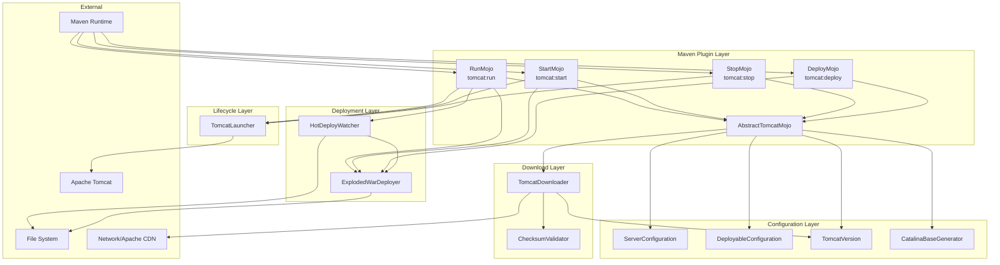

---

## Package Structure

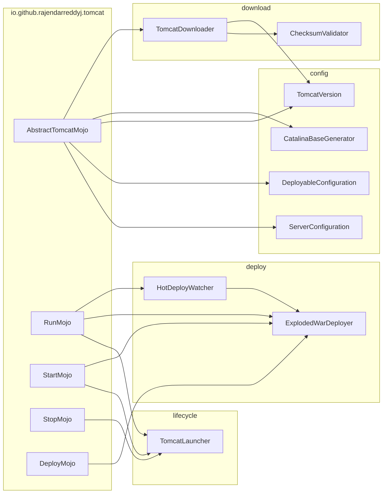

---

## Class Diagrams

### Mojo Hierarchy

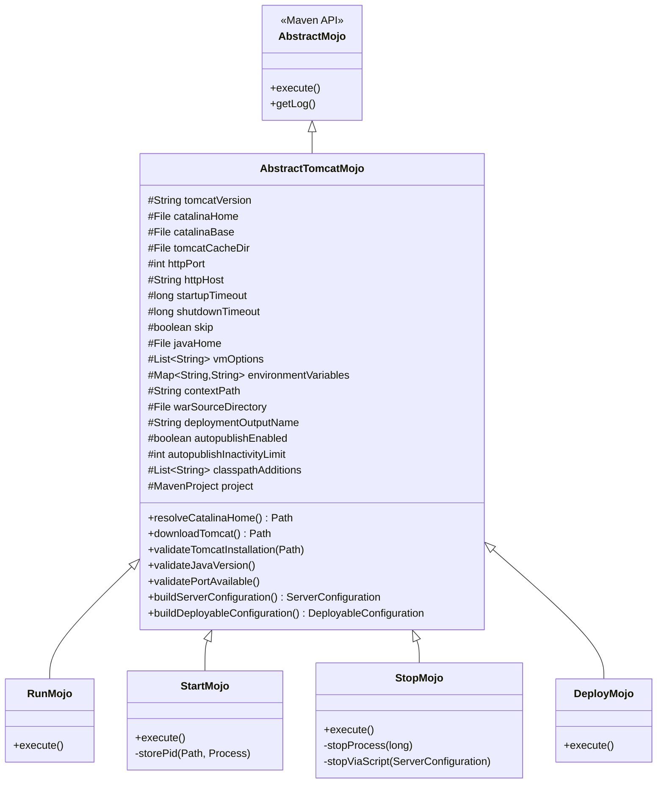

### Configuration Classes

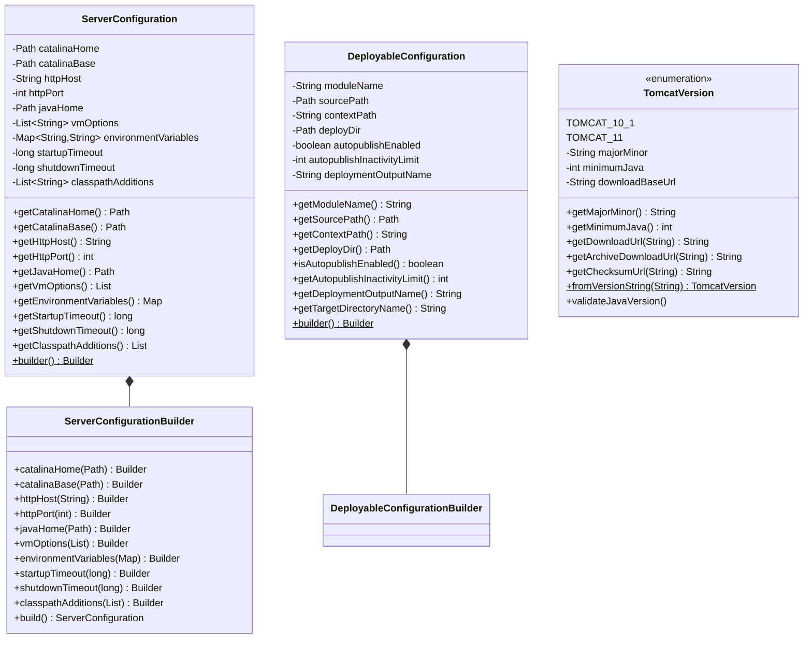

### Service Classes

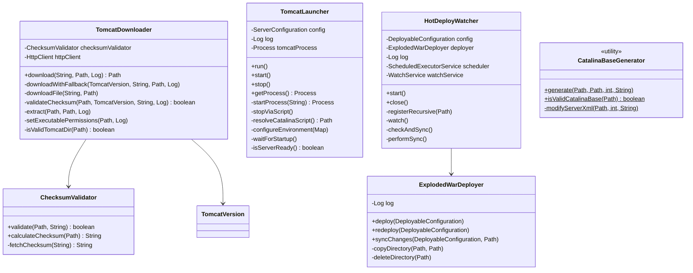

---

## Sequence Diagrams

### tomcat:run Goal

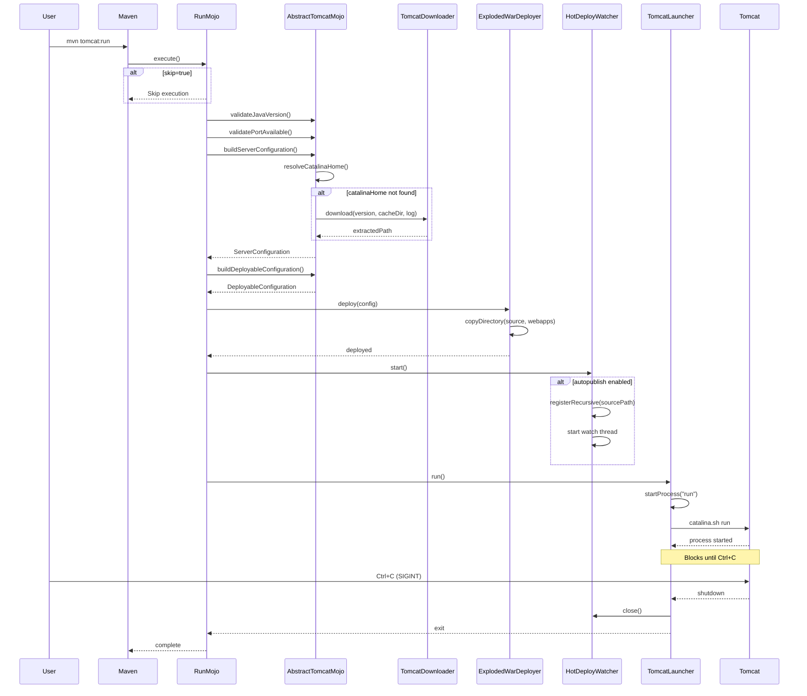

### tomcat:start Goal

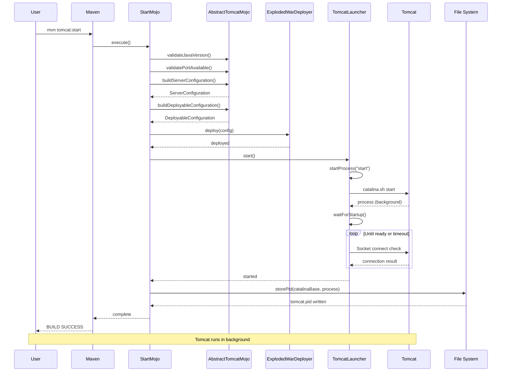

### tomcat:stop Goal

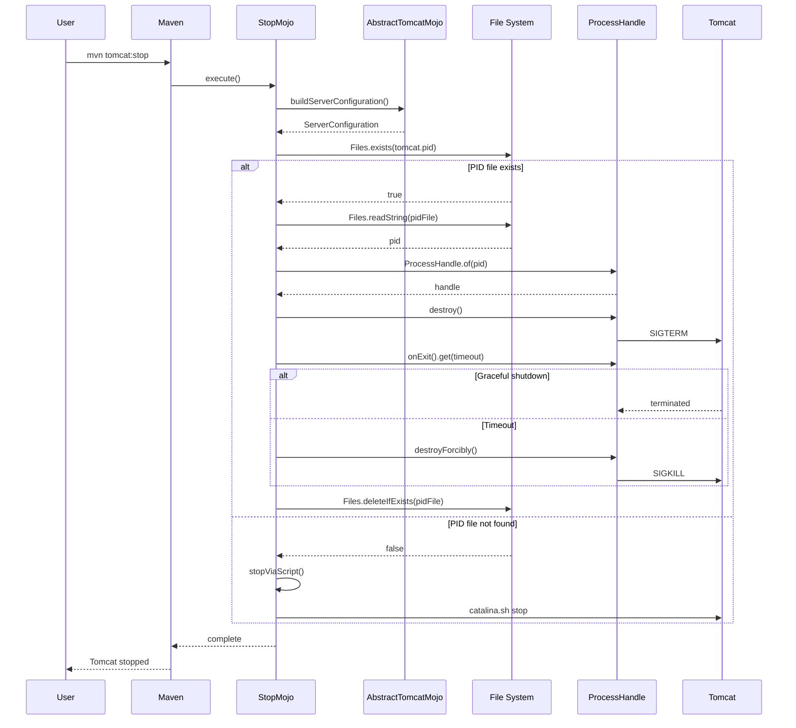

### tomcat:deploy Goal

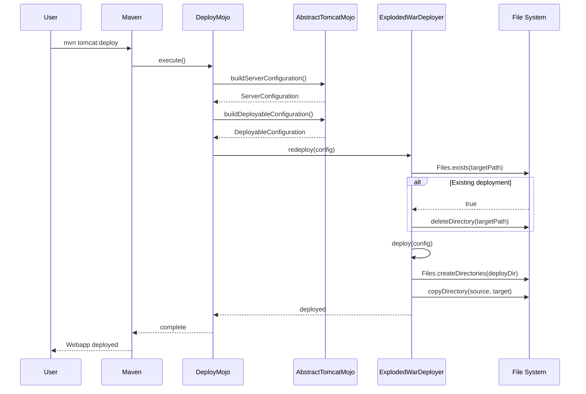

### Tomcat Download Flow

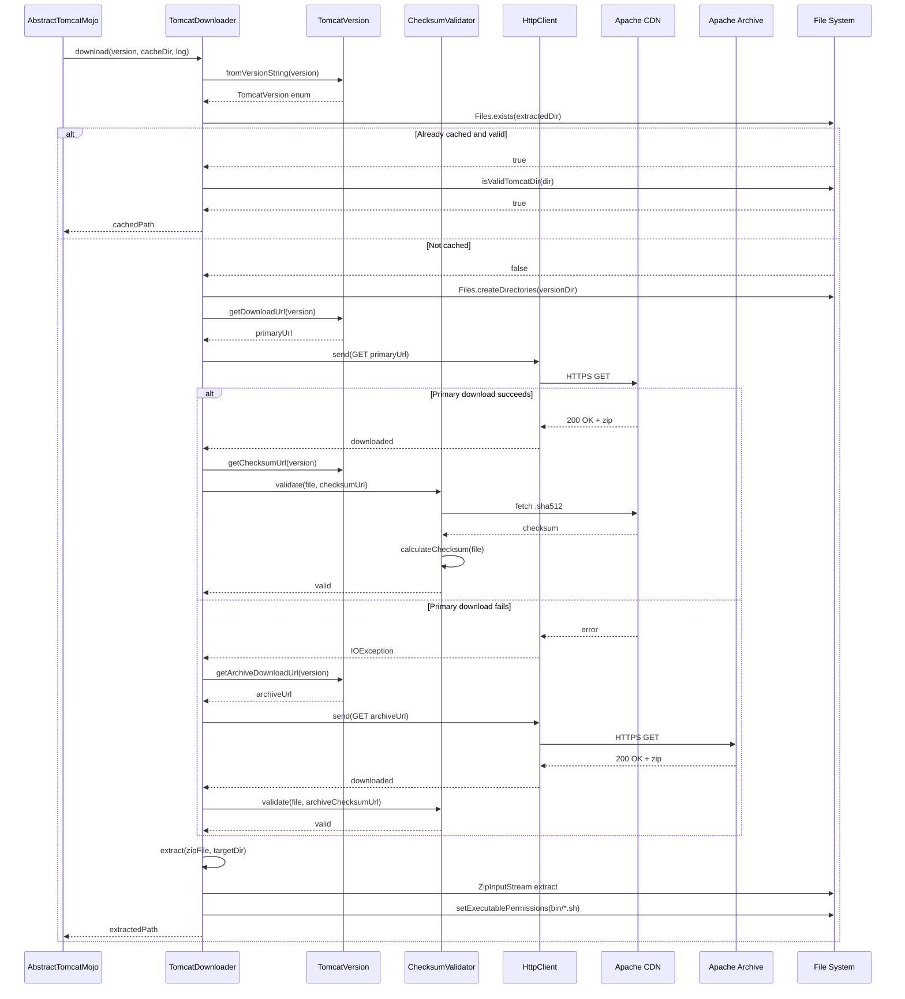

### Hot Deployment Flow

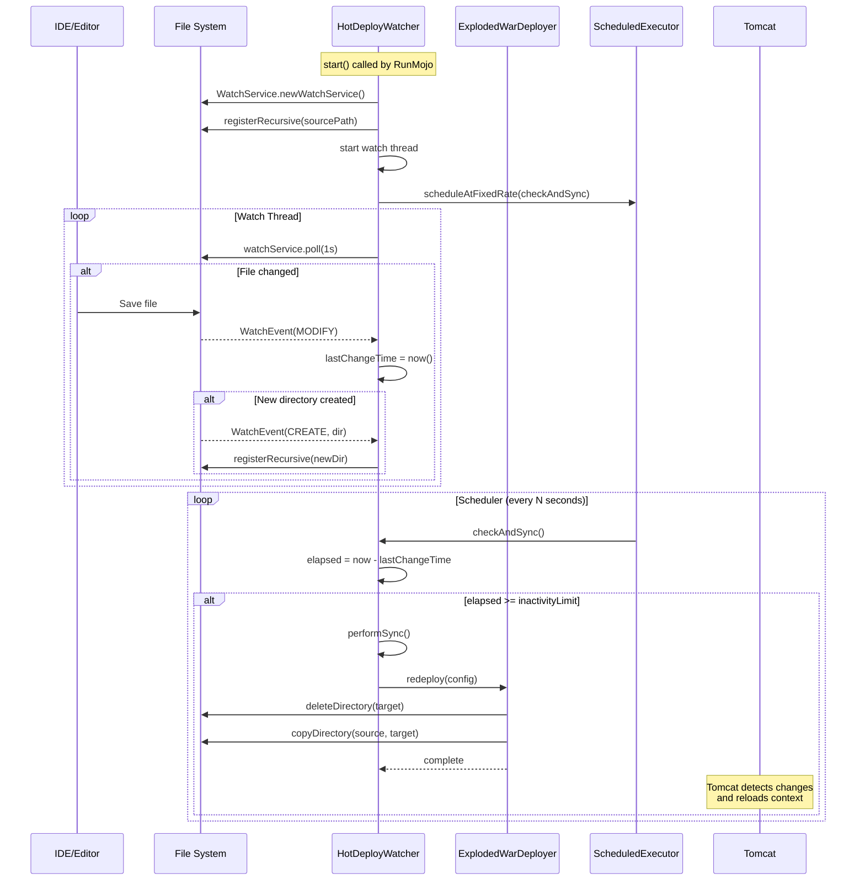

---

## Configuration Flow

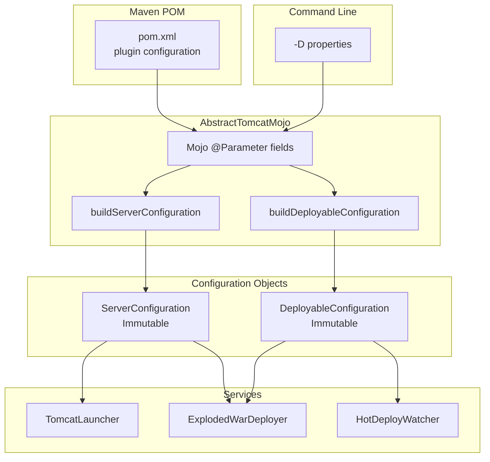

---

## Design Patterns

### Builder Pattern
Used in `ServerConfiguration` and `DeployableConfiguration` for constructing immutable configuration objects with many optional parameters.

```java
ServerConfiguration config = ServerConfiguration.builder()
    .catalinaHome(path)
    .httpPort(8080)
    .vmOptions(List.of("-Xmx1g"))
    .build();
```

### Template Method Pattern
`AbstractTomcatMojo` defines the skeleton of configuration building (resolving CATALINA_HOME, validating Java version, etc.), while concrete Mojos (`RunMojo`, `StartMojo`, etc.) implement specific execution logic.

### Strategy Pattern
`TomcatVersion` enum encapsulates version-specific behavior (download URLs, minimum Java requirements), allowing the downloader to work with different Tomcat versions without conditional logic.

### Observer Pattern
`HotDeployWatcher` uses Java's `WatchService` to observe file system events and trigger redeployment when files change.

### Facade Pattern
Each Mojo acts as a facade, orchestrating multiple services (downloader, deployer, launcher) to provide a simple interface for Maven users.

---

## Thread Model

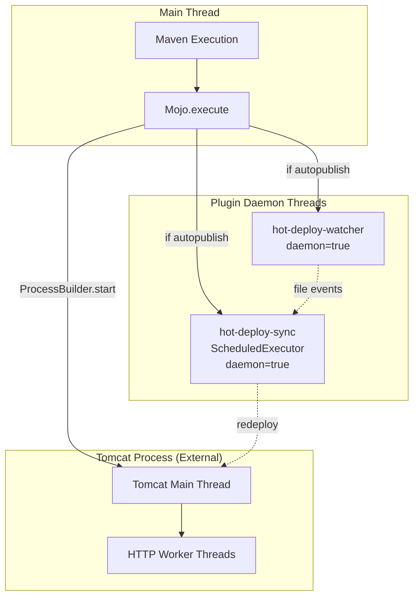

---

## Error Handling Strategy

| Error Type | Handling |
|------------|----------|
| Missing CATALINA_HOME | Auto-download Tomcat |
| Port in use | Fail fast with actionable message |
| Java version mismatch | Fail fast with version requirements |
| Download failure | Fallback to Apache Archive |
| Checksum mismatch | Retry from archive |
| Deployment failure | MojoExecutionException with details |
| Startup timeout | IOException with timeout info |
| Shutdown timeout | Force-kill process |

---

## Security Considerations

1. **Zip Slip Protection**: `TomcatDownloader.extract()` validates paths prevent directory traversal attacks
2. **Checksum Validation**: Downloads are verified using SHA-512 checksums
3. **Shutdown Port Disabled**: `CatalinaBaseGenerator` sets shutdown port to -1
4. **AJP Connector Disabled**: Commented out for development use
5. **No Credential Storage**: Plugin does not store any credentials

---

## Related Documentation

- [README.md](../README.md) - Usage and configuration
- [CONTRIBUTING.md](../CONTRIBUTING.md) - Development guidelines
- [PUBLISHING.md](PUBLISHING.md) - Release process
